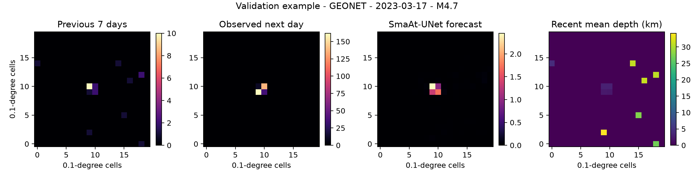

# QuakeCast Metal

Mac-native experiments for next-day earthquake-rate forecasting with
SmaAt-UNet. The model turns the seven days around an M4+ trigger into a 20 x 20
map of expected M2+ events during the following 24 hours.



This is an early research playground, not an operational warning system. The
current model captures useful spatial structure and still underpredicts extreme
sequence productivity.

## What is included

- Apple Metal and CPU training
- SCEDC, NCEDC, and GeoNet FDSN ingestion
- tectonic-event filtering and antimeridian handling
- connected-sequence temporal splits with 30-day embargoes
- paper-faithful rate, magnitude, and depth maps
- log-MSE and Poisson objectives
- sequence-balanced training and validation KPIs
- W&B metrics and checkpoint artifacts

The current archive contains 547,391 events and 15,859 M4+ triggers. Its frozen
2022-2023 validation set has 200 independent sequences. The 2024-2025 test set
remains sealed.

## Quick start

```bash
uv sync
uv run quakecast-demo --epochs 3 --samples 128 --output demo.png
```

Build real-catalogue tensors after downloading and preparing the public FDSN
catalogues:

```bash
uv run python scripts/build_tensors.py --root "/path/to/Earthquake Forecasting Data"
```

Train and record the important scientific KPIs in W&B:

```bash
uv run python scripts/train_real.py \
  --root "/path/to/Earthquake Forecasting Data" \
  --output quakecast-poisson.pt \
  --epochs 3 --loss poisson \
  --wandb-project quakecast-metal \
  --wandb-run-name poisson-v1
```

W&B tracks information gain per observed event, sequence-weighted likelihood
gain, total-rate calibration, extreme-event calibration, spatial CSI,
precision/recall, region-level results, and the final-test governance flag.

[Open the tracked Poisson run in Weights & Biases](https://wandb.ai/james-ball-98-none/quakecast-metal/runs/8wjptoxe).

## Preliminary validation

| Objective | Information gain/event | Sequence log-likelihood gain |
|---|---:|---:|
| Log-MSE | +3.05 | +19.09 |
| Poisson | +3.99 | +23.68 |

These are three-epoch validation baselines against the seven-day-mean
persistence forecast. ETAS, previous-day persistence, completeness-controlled
thresholds, and sequence-bootstrap uncertainty are still required before a
final scientific claim.

See [REAL_DATA_BASELINE.md](REAL_DATA_BASELINE.md) for the evaluation caveats
and [EVALUATION_PLAN.md](EVALUATION_PLAN.md) for the frozen protocol.

Based on Dervisi et al. (2025), [*Towards a deep learning approach for
short-term data-driven spatiotemporal seismicity rate
forecasting*](https://doi.org/10.1186/s40623-025-02241-6).

## License

MIT
