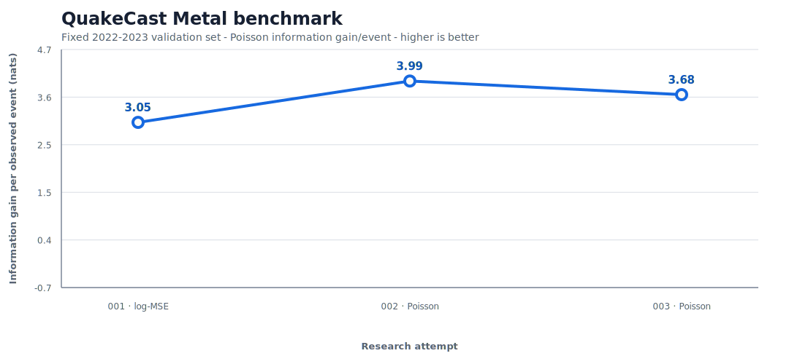

# Research benchmark

This directory is the public lab notebook for QuakeCast Metal. Each line in
`attempts.jsonl` is one evaluated checkpoint on the fixed 2022-2023 validation
set. The chart and leaderboard are generated from that log.

The primary score is Poisson information gain per observed event against the
seven-day-mean persistence forecast. Higher is better. A useful attempt should
also improve rate calibration and spatial CSI. The 2024-2025 final test remains
sealed.



The generated table is in [leaderboard.md](leaderboard.md).

## Record an attempt

Run this from the repository root after training a checkpoint:

```bash
uv run python scripts/benchmark_checkpoint.py \
  --root "/path/to/Earthquake Forecasting Data" \
  --checkpoint "/path/to/checkpoint.pt" \
  --attempt "003-short-name" \
  --description "The single change made in this attempt" \
  --wandb-url "https://wandb.ai/.../runs/..."
```

The command checks the frozen-data hashes, evaluates validation only, appends
the result, and regenerates both GitHub artifacts. Commit the log and generated
files together. Checkpoints belong in W&B artifacts rather than Git.

Metadata author: James Edward Ball.
